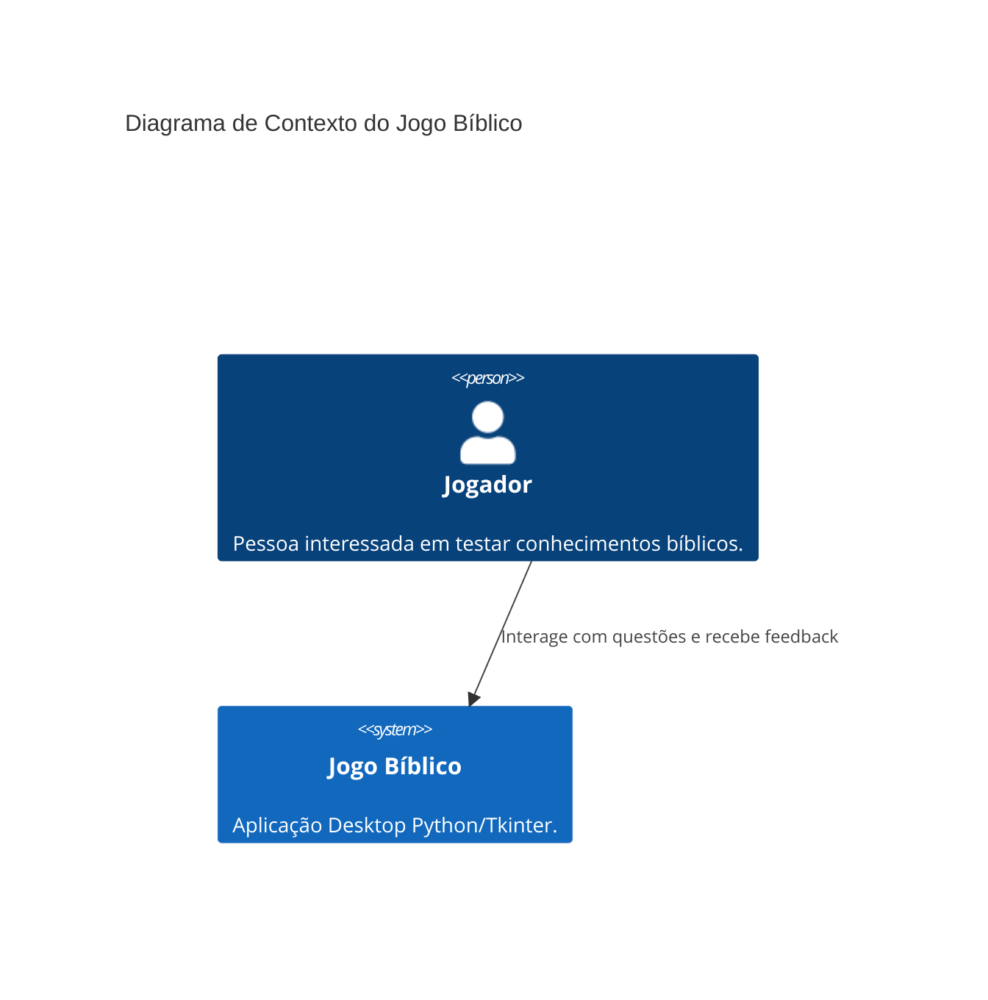
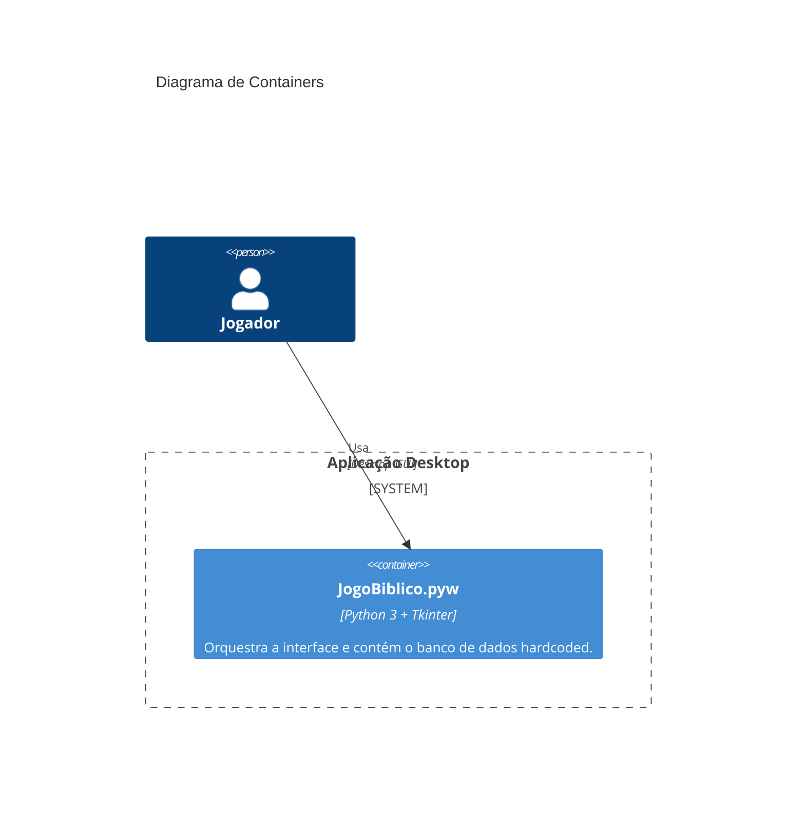

# Arquitetura do Sistema — projeto-python-biblia

## Visão Geral
O Jogo Bíblico é uma aplicação desktop monousuário, construída sobre o framework `tkinter`. A arquitetura é centrada em uma interface gráfica que orquestra a exibição de dados estáticos (perguntas) sem o uso de persistência externa.

## Estilo Arquitetural
- **Monolito de Camada Única:** Todas as responsabilidades (apresentação, lógica e dados) residem no mesmo processo e arquivo.
- **Event-Driven UI:** O fluxo é totalmente controlado por cliques do usuário que disparam callbacks pré-definidos.

## Diagramas C4

### Nível 1: Contexto

### Nível 2: Containers

## Dívidas Técnicas Identificadas
1. **DRY Violado:** Centenas de funções quase idênticas para cada questão e cada feedback.
2. **Acoplamento Extremo:** Dados bíblicos estão presos à implementação da interface.
3. **Escalabilidade de Conteúdo:** Adicionar 100 novas perguntas requer adicionar ~500 linhas de código manualmente.
4. **Ausência de Testes:** Não existem testes unitários ou de integração.
