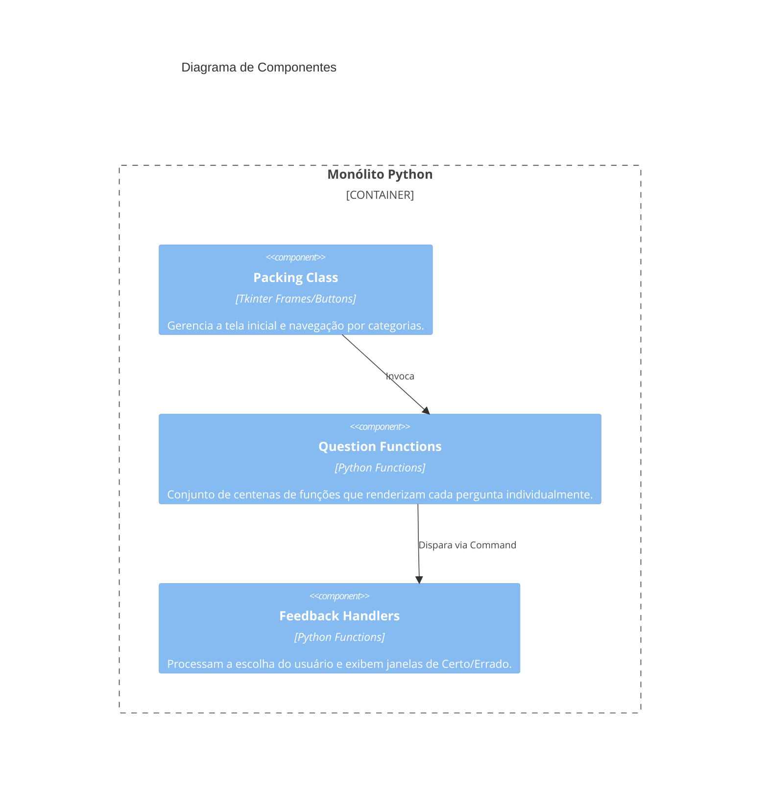

# C4 Components — projeto-python-biblia

Análise dos componentes internos do monólito `JogoBiblico.pyw`.

```mermaid
C4Component
    title Diagrama de Componentes
    
    Container_Boundary(monolith, "Monólito Python") {
        Component(packing, "Packing Class", "Tkinter Frames/Buttons", "Gerencia a tela inicial e navegação por categorias.")
        Component(question_funcs, "Question Functions", "Python Functions", "Conjunto de centenas de funções que renderizam cada pergunta individualmente.")
        Component(feedback_handlers, "Feedback Handlers", "Python Functions", "Processam a escolha do usuário e exibem janelas de Certo/Errado.")
    }
    
    Rel(packing, question_funcs, "Invoca")
    Rel(question_funcs, feedback_handlers, "Dispara via Command")
```
