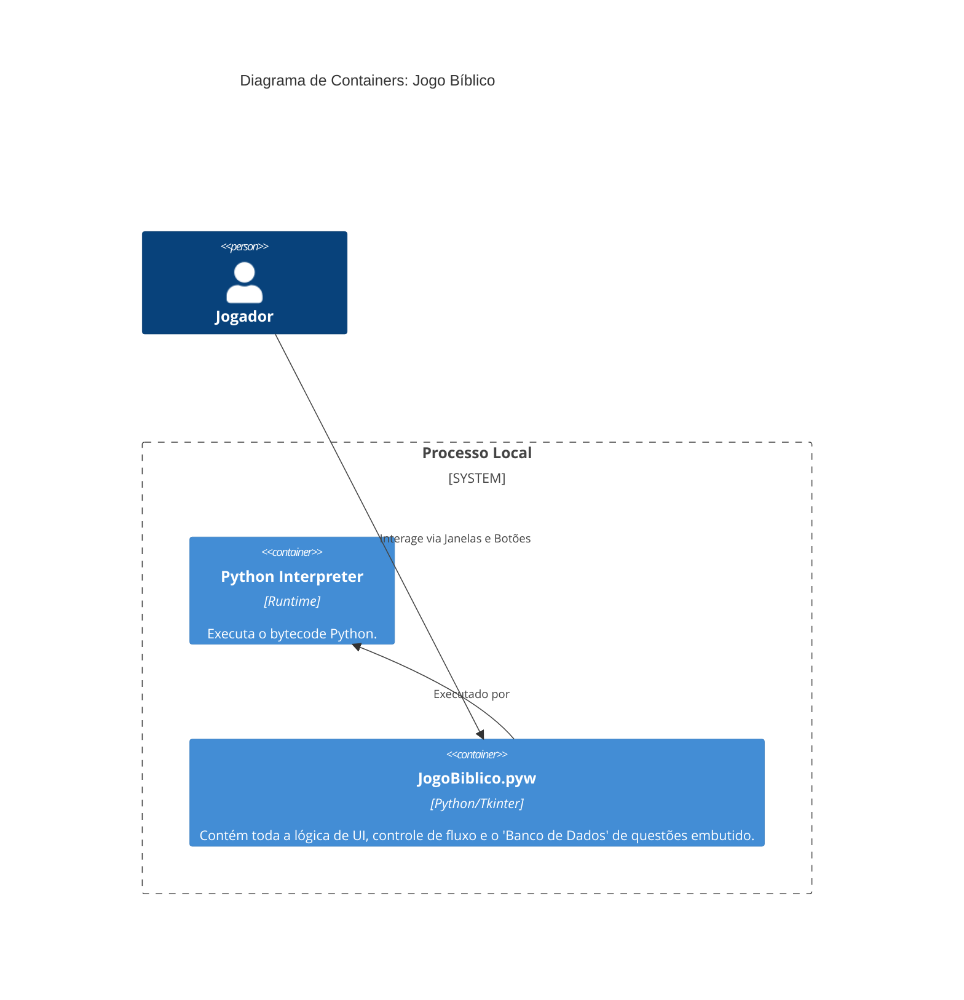

# C4 Containers — projeto-python-biblia

```mermaid
C4Container
    title Diagrama de Containers: Jogo Bíblico
    
    Person(player, "Jogador")
    
    System_Boundary(boundary, "Processo Local") {
        Container(python_runtime, "Python Interpreter", "Runtime", "Executa o bytecode Python.")
        Container(gui_app, "JogoBiblico.pyw", "Python/Tkinter", "Contém toda a lógica de UI, controle de fluxo e o 'Banco de Dados' de questões embutido.")
    }
    
    Rel(player, gui_app, "Interage via Janelas e Botões")
    Rel(gui_app, python_runtime, "Executado por")
```
