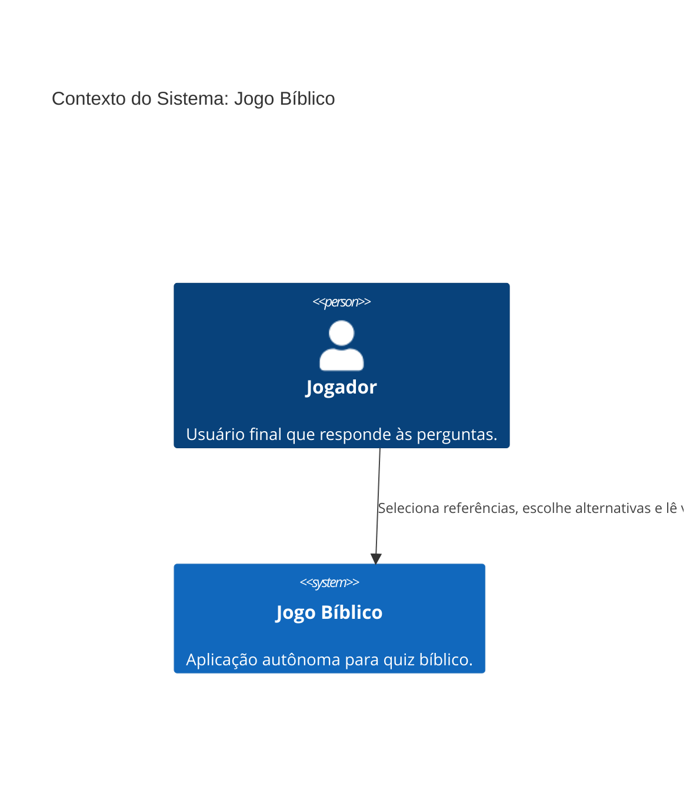

# C4 Context — projeto-python-biblia

```mermaid
C4Context
    title Contexto do Sistema: Jogo Bíblico
    
    Person(player, "Jogador", "Usuário final que responde às perguntas.")
    System(app, "Jogo Bíblico", "Aplicação autônoma para quiz bíblico.")
    
    Rel(player, app, "Seleciona referências, escolhe alternativas e lê versículos de confirmação.")
```
