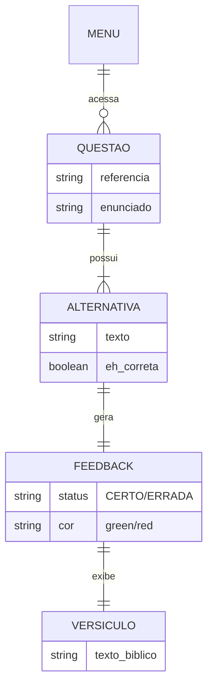

# ERD Completo (Modelo Implícito) — projeto-python-biblia

Como não existe banco de dados físico, este diagrama representa as entidades lógicas identificadas no código.

```mermaid
erDiagram
    MENU ||--o{ QUESTAO : "acessa"
    QUESTAO ||--|{ ALTERNATIVA : "possui"
    ALTERNATIVA ||--|| FEEDBACK : "gera"
    FEEDBACK ||--|| VERSICULO : "exibe"

    QUESTAO {
        string referencia
        string enunciado
    }

    ALTERNATIVA {
        string texto
        boolean eh_correta
    }

    FEEDBACK {
        string status "CERTO/ERRADA"
        string cor "green/red"
    }

    VERSICULO {
        string texto_biblico
    }
```
