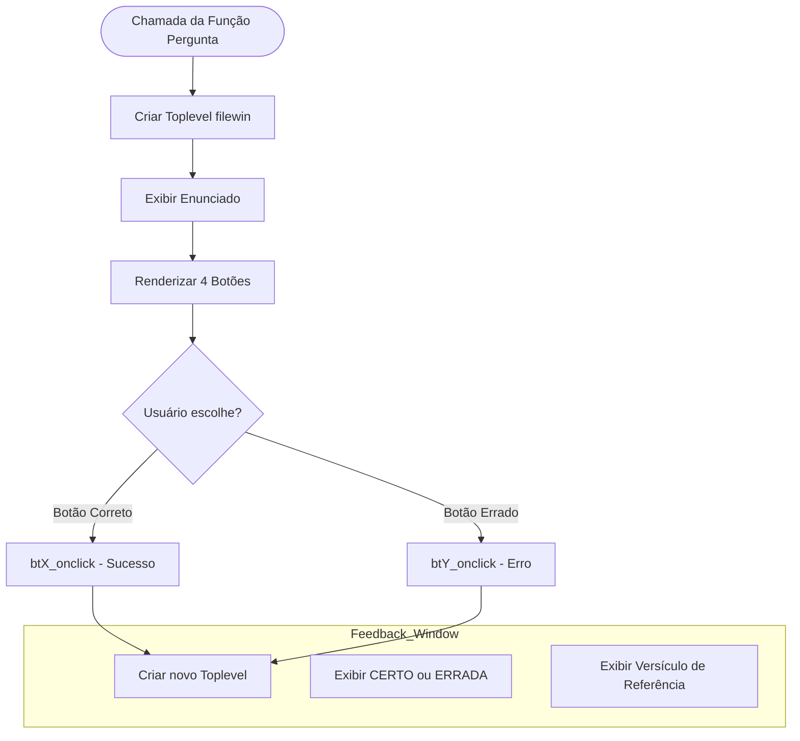

# Fluxogramas — Question Bank

Este fluxograma descreve o padrão repetitivo de interação em cada questão bíblica.

```mermaid
graph TD
    Trigger([Chamada da Função Pergunta]) --> NewWin[Criar Toplevel filewin]
    NewWin --> ShowLabel[Exibir Enunciado]
    ShowLabel --> RenderOptions[Renderizar 4 Botões]
    
    RenderOptions --> UserChoice{Usuário escolhe?}
    
    UserChoice -- Botão Correto --> CorrectHandler[btX_onclick - Sucesso]
    UserChoice -- Botão Errado --> ErrorHandler[btY_onclick - Erro]
    
    subgraph Feedback_Window
        FeedbackWin[Criar novo Toplevel]
        ShowStatus[Exibir CERTO ou ERRADA]
        ShowReference[Exibir Versículo de Referência]
    end
    
    CorrectHandler --> FeedbackWin
    ErrorHandler --> FeedbackWin
```
