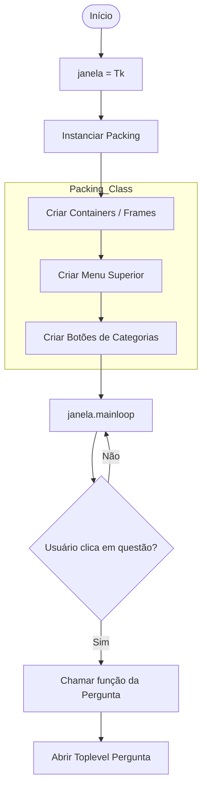

# Fluxogramas — Quiz Engine

Este fluxograma descreve o ciclo de vida principal da aplicação.

```mermaid
graph TD
    Start([Início]) --> InitTk[janela = Tk]
    InitTk --> InitPacking[Instanciar Packing]
    
    subgraph Packing_Class
        CreateContainers[Criar Containers / Frames]
        CreateMenu[Criar Menu Superior]
        CreateButtons[Criar Botões de Categorias]
    end
    
    InitPacking --> CreateContainers
    CreateContainers --> CreateMenu
    CreateMenu --> CreateButtons
    
    CreateButtons --> MainLoop[janela.mainloop]
    
    MainLoop --> UserClick{Usuário clica em questão?}
    UserClick -- Sim --> OpenQuestion[Chamar função da Pergunta]
    OpenQuestion --> QuestionWindow[Abrir Toplevel Pergunta]
    UserClick -- Não --> MainLoop
```
