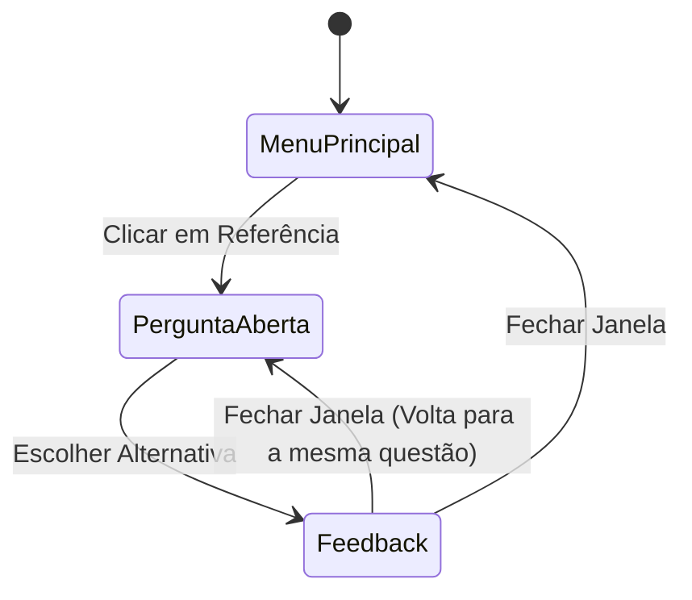

# Máquinas de Estado — projeto-python-biblia

O sistema segue um fluxo cíclico de interação simples, sem persistência de estado complexo.

## Ciclo de Vida da Questão

## Estados da Janela de Feedback

| Estado | Gatilho | Efeito Visual |
|--------|---------|---------------|
| **Sucesso** | Botão correto acionado | Fundo Verde, Texto "CERTO" |
| **Erro** | Botão incorreto acionado | Fundo Vermelho, Texto "ERRADA" |

**Nota:** Devido ao uso de `Toplevel`, múltiplas janelas de feedback podem ser abertas simultaneamente se o usuário não fechar a anterior, o que é um comportamento inferido da implementação. 🟡 INFERIDO
