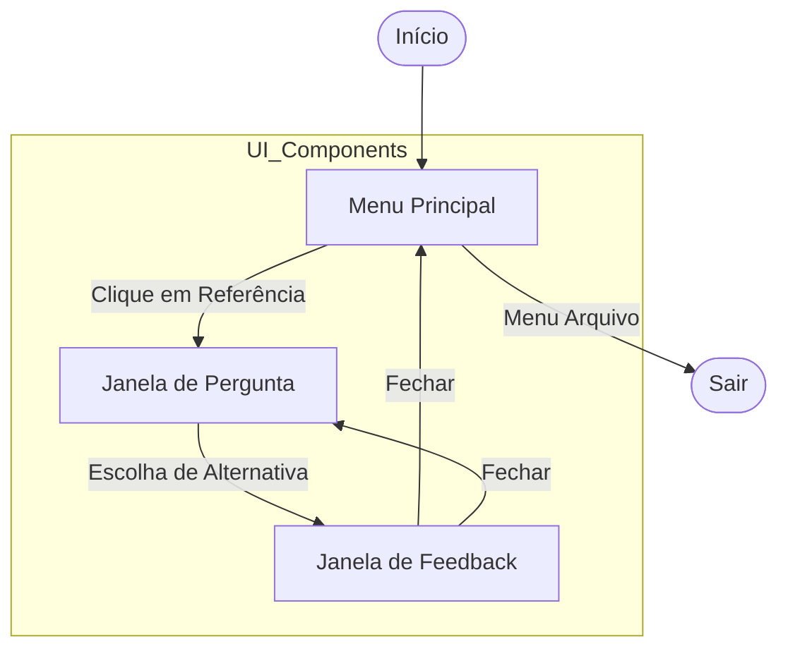

# Fluxo de Navegação — projeto-python-biblia

## Pontos de Entrada e Saída
- **Entrada:** Inicialização do `JogoBiblico.pyw`.
- **Saída:** Botão de fechar do Windows (X) ou Menu Arquivo (se implementado).
